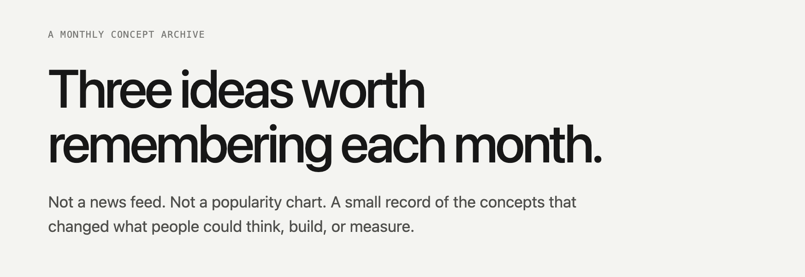
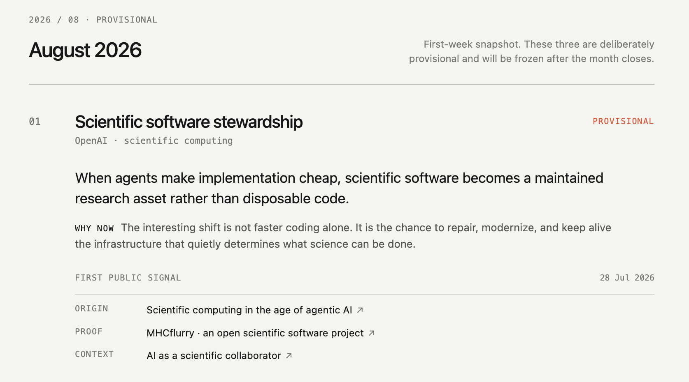
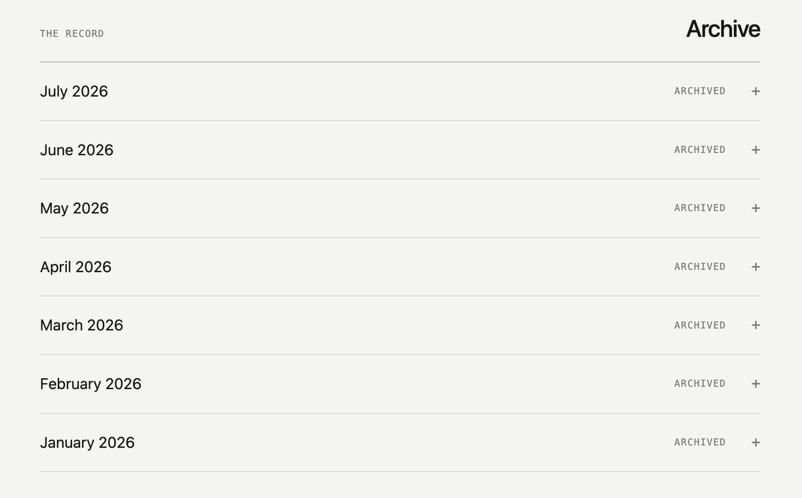

# CONCEPTS

Three ideas worth remembering each month.

Live page: [demouo.github.io/monthly-concepts](https://demouo.github.io/monthly-concepts/)

This is a deliberately small archive of breakthrough concepts in AI and technology. Starting in January 2026, each completed month keeps exactly three entries. The archive is editorial, not a popularity chart or a news feed.

## Preview

## What qualifies

- The public contribution or first clear articulation belongs to 2026. Older breakthroughs are not backfilled into the ranked archive.
- It changes how a problem is framed, built, measured, or operated.
- It has generative force: other projects, papers, products, or methods can grow from it.
- It survives a short explanation without a score, leaderboard, or hype language.

Each entry has exactly three links:

- Origin — the first articulation or primary work.
- Proof — an implementation, result, benchmark, or working system.
- Context — the clearest route into the idea.

The page keeps no numeric score. The only editorial states are Archived, Emerging, Established, and Provisional. August 2026 is intentionally provisional because the month is still open.

## Repository

- index.html — the page shell.
- content.js — the monthly archive and its source links.
- app.js — the renderer.
- styles.css — the restrained visual system.
- .github/workflows/pages.yml — GitHub Pages deployment.

To update the archive, edit content.js, keep three concepts per completed month, and run the local checks described below.

## Local preview

Run: python3 -m http.server 8000

Then open <http://localhost:8000>.

## Editorial boundary

The archive is allowed to be incomplete. A loud launch can remain outside it. A concept can be removed later if it does not produce evidence or if a better contribution explains the month more honestly.
